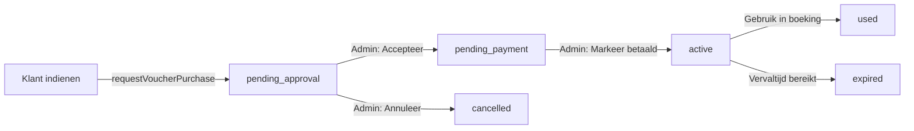

# 🎟️ Theaterbon Admin Goedkeuringsworkflow - COMPLEET

## Datum: 1 november 2025

## 🎯 Overzicht

Een volledige, professionele admin goedkeuringsworkflow voor theaterbonnen is geïmplementeerd. Klanten kunnen nu theaterbonnen **aanvragen** (niet direct kopen), die vervolgens door een admin moeten worden goedgekeurd voordat ze actief worden.

## 🔄 De Nieuwe Workflow

### Voor de Klant

1. **Aanvraag indienen** (`/vouchers`)
   - Klant selecteert arrangement (BWF/BWFM)
   - Kiest aantal theaterbonnen (1-50)
   - Vult bezorginformatie in
   - Verstuurt aanvraag

2. **Bevestiging ontvangen** (`/voucher-order-success`)
   - Klant ziet bedankpagina
   - Uitleg van verwerkingsproces
   - Verwachte timeline: 1-2 werkdagen

3. **Email ontvangen** (gesimuleerd)
   - Betaalinstructies
   - Unieke vouchercode
   - Activatie na betaling

### Voor de Admin

1. **Bestellingen Inbox** (Admin Panel → Producten → Bestellingen)
   - Alle nieuwe aanvragen zichtbaar met status "Wacht op goedkeuring"
   - Rode notificatie badge voor nieuwe aanvragen
   - Filter per status

2. **Aanvraag beoordelen**
   - Bekijk alle besteldetails
   - Klantgegevens
   - Bezorgmethode
   - Totaalbedrag

3. **Goedkeuren**
   - Klik op "Accepteer"
   - Systeem genereert unieke code (formaat: XXXX-XXXX-XXXX)
   - Status wordt "Wacht op betaling"
   - Simulatie: "📧 Betaallink verstuurd naar klant"

4. **Betaling ontvangen**
   - Markeer bestelling als "Betaald"
   - Status wordt "Actief"
   - Theaterbon is klaar voor gebruik

## 🏗️ Technische Implementatie

### 1. Type Definities (`src/types/index.ts`)

```typescript
// 🆕 Nieuwe status enum
export type VoucherOrderStatus = 
  | 'pending_approval'  // Wacht op admin goedkeuring
  | 'pending_payment'   // Goedgekeurd, wacht op betaling
  | 'active'            // Betaald en actief
  | 'used'              // Volledig gebruikt
  | 'cancelled'         // Geannuleerd
  | 'expired';          // Verlopen

// 🆕 Uitgebreide IssuedVoucher interface
export interface IssuedVoucher {
  id: string;
  code?: string; // 🆕 OPTIONEEL - pas gegenereerd na goedkeuring
  status: VoucherOrderStatus;
  
  metadata: {
    // Complete besteldata
    buyerName: string;
    buyerEmail: string;
    buyerPhone: string;
    
    // Gift informatie (optioneel)
    isGift?: boolean;
    recipientName?: string;
    recipientEmail?: string;
    personalMessage?: string;
    
    // Bezorging
    deliveryMethod: 'email' | 'shipping' | 'pickup';
    shippingAddress?: string;
    shippingCity?: string;
    shippingPostalCode?: string;
    shippingCountry?: string;
    
    // Bestelling
    quantity: number;
    arrangement?: Arrangement;
    arrangementName?: string;
    eventType?: string;
    eventTypeName?: string;
    
    // Financieel
    shippingCost?: number;
    totalAmount: number;
    paymentStatus?: 'pending' | 'paid' | 'failed';
    
    // Tracking
    approvedAt?: Date;
    approvedBy?: string;
    paidAt?: Date;
  };
  
  // Admin notities
  adminNotes?: string;
}
```

### 2. Store Functies (`src/store/voucherStore.ts`)

#### `requestVoucherPurchase()`
```typescript
// Maak nieuwe bestelling aan met status 'pending_approval'
// Slaat op in localStorage
// Geen code, geen betaling - alleen aanvraag
```

#### `loadIssuedVouchers()`
```typescript
// Laad alle bestellingen uit localStorage
// Sorteer op datum (nieuwste eerst)
// Update store state
```

#### `approveVoucher(voucherId: string)`
```typescript
// 🎯 KERNFUNCTIE
// 1. Genereer unieke code (XXXX-XXXX-XXXX format)
// 2. Bereken vervaldatum (1 jaar)
// 3. Update status → 'pending_payment'
// 4. Sla op in localStorage
// 5. Simuleer email: console.log("📧 Betaallink verstuurd...")
```

#### `cancelVoucher(voucherId: string, reason?: string)`
```typescript
// Update status → 'cancelled'
// Bewaar reden in adminNotes
```

#### `updateVoucherStatus(voucherId: string, status: VoucherOrderStatus)`
```typescript
// Generieke status update
// Gebruikt voor "Markeer betaald" functie
```

### 3. Admin Component (`src/components/admin/IssuedVouchersTable.tsx`)

**Features:**
- Status filter tabs met badges
- Expandable bestelkaarten
- Actieknoppen per status:
  - **Pending Approval**: "Accepteer" + "Annuleer"
  - **Pending Payment**: "Markeer betaald"
- Detail views:
  - Gift informatie
  - Verzendadres
  - Tijdstempels (aangemaakt, goedgekeurd, betaald)
  - Admin notities

**UI Design:**
- Zwarte achtergrond met slate accenten
- Gold highlights voor actieve elementen
- Status badges met icons en kleuren
- Responsive grid layout
- Hover states en transitions

### 4. Klant Flow Update (`src/components/voucher/VoucherPurchasePageNew.tsx`)

**Oude flow:**
```typescript
handleSubmit() {
  submitPurchase() → Redirect naar betaling
}
```

**Nieuwe flow:**
```typescript
handleSubmit() {
  // 🆕 Maak aanvraag aan
  requestVoucherPurchase({
    status: 'pending_approval',
    metadata: { /* alle form data */ }
  });
  
  // 🆕 Redirect naar bedankpagina
  window.location.href = '/voucher-order-success';
}
```

### 5. Success Page (`src/components/voucher/VoucherOrderSuccessPage.tsx`)

**Content:**
- ✅ Bevestiging van aanvraag
- 📋 Uitleg van proces (3 stappen)
- ⏱️ Verwachte verwerkingstijd (1-2 werkdagen)
- 📧 Reminder om inbox te checken
- 🔗 Navigatie: Terug naar home / Nog een bestellen

### 6. Integration (`src/components/admin/ProductsManager.tsx`)

**Updates:**
- Nieuwe "Bestellingen" tab toegevoegd als **eerste tab**
- Default tab is nu "Bestellingen" (was "Event Types")
- Renders `IssuedVouchersTable` component
- Toegankelijk via: Admin Panel → Producten → Bestellingen

### 7. Routing (`src/App.tsx`)

```typescript
// 🆕 Nieuwe route
<Route path="/voucher-order-success" element={<VoucherOrderSuccessPage />} />

// Bestaande routes (ook /vouchers alias)
<Route path="/voucher" element={<VoucherPurchasePageNew />} />
<Route path="/vouchers" element={<VoucherPurchasePageNew />} />
```

## 📊 Status Overgangen



## 🎨 UI/UX Verbeteringen

### Admin Inbox
- **Notificatie badge**: Rode pulserende dot bij pending approvals
- **Status kleuren**:
  - 🟡 Pending Approval: Geel
  - 🔵 Pending Payment: Blauw
  - 🟢 Active: Groen
  - ⚪ Used: Grijs
  - 🔴 Cancelled: Rood
  
### Bestelkaarten
- **Compact overzicht** met uitklap voor details
- **Klantinfo** prominent zichtbaar
- **Bestelling details** met icons
- **Vouchercode** in gold mono font (na goedkeuring)

### Success Page
- **Stapsgewijze uitleg** van proces
- **Visuele tijdsindicator** (1-2 werkdagen)
- **Herhaalde email reminder** (check inbox/spam)
- **CTA buttons**: Home / Nog een bestellen

## 🔐 Data Storage

**localStorage Keys:**
```
issued_vouchers: IssuedVoucher[]
```

**Data Flow:**
1. Klant: Browser → requestVoucherPurchase → localStorage
2. Admin: localStorage → loadIssuedVouchers → Store State
3. Admin: approveVoucher → localStorage (update)
4. Admin: Refresh pagina → Data blijft persistent

## 🧪 Testing Checklist

### Klant Flow
- [ ] Navigate naar `/vouchers`
- [ ] Selecteer arrangement
- [ ] Kies aantal (test 1, 5, 50)
- [ ] Selecteer bezorgmethode
- [ ] Vul formulier in (alle velden)
- [ ] Submit → Redirect naar success page
- [ ] Success page toont juiste informatie

### Admin Flow
- [ ] Navigate naar Admin → Producten → Bestellingen
- [ ] Nieuwe bestelling zichtbaar met "Wacht op goedkeuring"
- [ ] Notificatie badge aanwezig
- [ ] Klik "Bekijk details" → Expand werkt
- [ ] Alle besteldata zichtbaar
- [ ] Klik "Accepteer":
  - Confirmation dialog
  - Code gegenereerd (XXXX-XXXX-XXXX)
  - Status → "Wacht op betaling"
  - Console log: "📧 Betaallink verstuurd..."
- [ ] Filter tabs werken (alle statussen)
- [ ] Klik "Markeer betaald":
  - Status → "Actief"
  - Code blijft zichtbaar

### Edge Cases
- [ ] Meerdere bestellingen tegelijk
- [ ] Lange namen/adressen (layout blijft netjes)
- [ ] Gift vs persoonlijk (metadata verschil)
- [ ] Annuleren met/zonder reden
- [ ] Browser refresh behoudt data (localStorage)

## 📈 Statistieken

**Code Changes:**
- 5 bestanden aangepast
- 2 nieuwe components
- 1 nieuwe route
- ~600 regels nieuwe code

**Build Status:**
- ✅ TypeScript: Geen fouten
- ✅ Build: 989ms
- ✅ Deploy: Succesvol
- 📦 Bundle size: 57 files

## 🚀 Deployment

**Live URL:** https://dinner-theater-booking.web.app

**Admin Panel:** https://dinner-theater-booking.web.app/admin

**Voucher Aanvraag:** https://dinner-theater-booking.web.app/vouchers

**Success Page:** https://dinner-theater-booking.web.app/voucher-order-success

## 🎯 Resultaat

✅ **Volledige admin goedkeuringsworkflow geïmplementeerd**
✅ **Klanten kunnen theaterbonnen aanvragen (niet direct kopen)**
✅ **Admin beoordeelt en keurt goed via professionele inbox**
✅ **Unieke codes worden pas gegenereerd na goedkeuring**
✅ **Status tracking door hele proces**
✅ **Gebruiksvriendelijke UI voor klant en admin**
✅ **Persistent data storage (localStorage)**
✅ **Deployed en live**

## 🔮 Toekomstige Verbeteringen

### Email Integratie
- Vervang console.log met echte email service
- Template voor goedkeuringsmail
- Template voor betaalinstructies
- Bevestigingsmail na betaling

### Payment Gateway
- Mollie/Stripe integratie
- Automatische status update na betaling
- Payment link generatie
- Refund handling

### Backend Sync
- Firebase Firestore integratie
- Realtime updates
- Multi-admin support
- Audit logging

### Advanced Features
- Bulk actions (goedkeur meerdere tegelijk)
- Export naar Excel/CSV
- Zoekfunctie (naam, email, code)
- Dashboard statistieken
- Email notificaties voor admins bij nieuwe aanvragen

---

**Status**: ✅ Compleet en Live  
**Deployment**: https://dinner-theater-booking.web.app  
**Build Time**: 989ms  
**Bestanden**: 57 in dist  

**Volgende Stap**: Test de complete workflow live en verzamel gebruikersfeedback! 🎉
