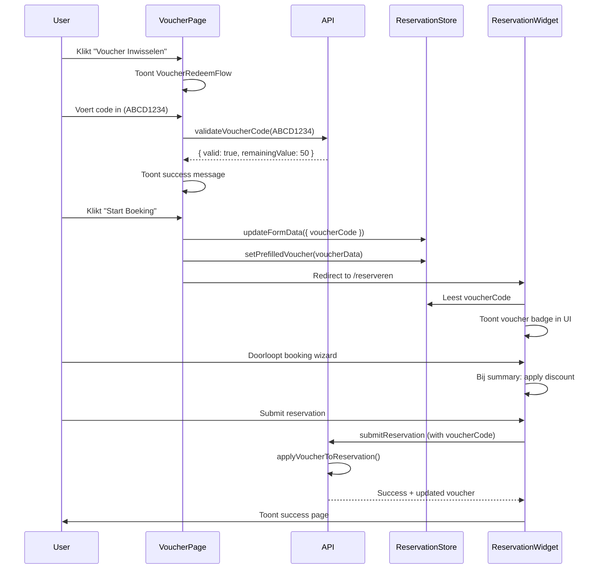

# 🎫 Theater Voucher - Compleet Technisch Ontwerp

**Datum:** 24 oktober 2025  
**Versie:** 1.0  
**Status:** Ontwerp & Implementatie Ready

---

## 📋 Executive Summary

Dit document beschrijft de complete technische architectuur voor een nieuwe, **standalone "Theater Voucher" pagina** die volledig gescheiden is van de bestaande `ReservationWidget`. Deze pagina heeft twee hoofdfuncties:

1. **Voucher Kopen** - Bezoekers kunnen cadeaubonnen kopen
2. **Voucher Inwisselen** - Bezoekers kunnen hun vouchercode gebruiken om een boeking te starten

---

## 🏗️ Architectuur Overzicht

```
┌─────────────────────────────────────────────────────────────┐
│                    Theater Voucher Page                      │
│                    (Nieuwe standalone pagina)                │
└─────────────────────────────────────────────────────────────┘
                              ↓
        ┌─────────────────────┴─────────────────────┐
        ↓                                           ↓
┌───────────────────┐                   ┌──────────────────────┐
│  Voucher Kopen    │                   │  Voucher Inwisselen  │
│  (Purchase Flow)  │                   │  (Redeem Flow)       │
└───────────────────┘                   └──────────────────────┘
        ↓                                           ↓
┌───────────────────┐                   ┌──────────────────────┐
│ Payment Gateway   │                   │ → ReservationWidget  │
│ (Mollie/Stripe)   │                   │   (met pre-fill)     │
└───────────────────┘                   └──────────────────────┘
        ↓
┌───────────────────┐
│ Admin Dashboard   │
│ Issued Vouchers   │
└───────────────────┘
```

---

## 🎯 Antwoorden op Je Specifieke Vragen

### **Vraag A & B: Workflow voor "Voucher Inwisselen"**

**✅ AANBEVOLEN OPLOSSING: Optie B - Code Validatie + Redirect**

**Motivatie:**
1. **DRY Principle** - Hergebruik van je bestaande, goed werkende `ReservationWidget`
2. **Consistentie** - Gebruikers krijgen exact dezelfde boekingservaring
3. **Onderhoudbaarheid** - Geen duplicatie van complexe boekingslogica
4. **Flexibiliteit** - Toekomstige wijzigingen aan boekingsflow hoeven maar op 1 plek

**Hoe het werkt:**
```typescript
// 1. Gebruiker voert vouchercode in op VoucherPage
// 2. VoucherRedeemFlow valideert de code via API
// 3. Bij succesvolle validatie:
//    - Sla voucher info op in reservationStore
//    - Redirect naar de bestaande ReservationWidget
//    - ReservationWidget start met voucher pre-filled
//    - Gebruiker doorloopt normale booking wizard
//    - Bij submit wordt voucher automatisch toegepast
```

---

## 📦 1. Nieuwe API Endpoints (apiService.ts)

### **1.1 Public Voucher Templates**

```typescript
/**
 * Haalt alle actieve voucher templates op voor de publieke website
 * Deze templates worden getoond in de "Voucher Kopen" sectie
 */
async getPublicVoucherTemplates(): Promise<ApiResponse<VoucherTemplate[]>>
```

**Doel:** Lijst met beschikbare cadeaubonnen (€25, €50, €100, etc.)  
**Gebruikt door:** `VoucherPurchaseForm.tsx`  
**Filters:** Alleen `isActive: true` templates

---

### **1.2 Create Voucher Purchase**

```typescript
/**
 * Initieert de aankoop van een nieuwe voucher
 * Creëert een pending IssuedVoucher en start payment flow
 */
async createVoucherPurchase(
  purchaseData: VoucherPurchaseRequest
): Promise<ApiResponse<VoucherPurchaseResponse>>

// Types:
interface VoucherPurchaseRequest {
  templateId: string;           // Welke template (€25, €50, etc.)
  quantity: number;             // Aantal vouchers
  recipientName?: string;       // Voor wie (optioneel, kan ook koper zijn)
  recipientEmail?: string;      // Email ontvanger (optioneel)
  personalMessage?: string;     // Persoonlijk bericht
  
  // Koper informatie
  buyerName: string;
  buyerEmail: string;
  buyerPhone: string;
  
  // Verzendmethode
  deliveryMethod: 'email' | 'physical'; // Email direct of fysiek versturen
}

interface VoucherPurchaseResponse {
  voucherId: string;            // ID van de nieuwe IssuedVoucher
  paymentUrl: string;           // Redirect naar Mollie/Stripe
  paymentId: string;            // Voor payment tracking
  temporaryCode?: string;       // Preview code (wordt pas geactiveerd na betaling)
}
```

**Doel:** Start het aankoopproces  
**Workflow:**
1. Valideer template bestaat en is actief
2. Creëer `IssuedVoucher` met `status: 'pending_payment'`
3. Genereer unieke voucher code (8-12 karakters alfanumeriek)
4. Initieer payment via Mollie/Stripe
5. Return payment URL voor redirect
6. **Webhook:** Bij succesvolle betaling → update voucher `status: 'active'` + verzend email

---

### **1.3 Validate Voucher Code**

```typescript
/**
 * Controleert of een vouchercode geldig is
 * Gebruikt bij inwisselen om saldo en geldigheid te checken
 */
async validateVoucherCode(
  code: string
): Promise<ApiResponse<VoucherValidationResult>>

interface VoucherValidationResult {
  isValid: boolean;
  voucher?: IssuedVoucher;      // Volledige voucher details als valid
  remainingValue: number;       // Resterende waarde
  expiryDate: Date;             // Vervaldatum
  errorReason?: string;         // Waarom niet valid (expired, used, not found)
}
```

**Doel:** Real-time validatie van vouchercodes  
**Validaties:**
- Code bestaat in database
- `status === 'active'`
- `expiryDate > now`
- `remainingValue > 0`

**Gebruikt door:** `VoucherRedeemFlow.tsx`

---

### **1.4 Apply Voucher to Reservation**

```typescript
/**
 * Past een voucher toe op een reservering
 * Wordt aangeroepen tijdens de checkout in ReservationWidget
 */
async applyVoucherToReservation(
  voucherCode: string,
  reservationId: string,
  amountUsed: number
): Promise<ApiResponse<VoucherApplicationResult>>

interface VoucherApplicationResult {
  success: boolean;
  newRemainingValue: number;
  discountApplied: number;
  voucher: IssuedVoucher;
}
```

**Doel:** Verwerk voucher tijdens checkout  
**Logica:**
1. Valideer voucher nogmaals
2. Bereken te gebruiken bedrag (min(remainingValue, reservationTotal))
3. Update `IssuedVoucher.remainingValue`
4. Voeg `reservationId` toe aan `usedInReservationIds[]`
5. Als `remainingValue === 0` → update `status: 'used'`
6. Return nieuwe saldo

---

### **1.5 Get Voucher Status**

```typescript
/**
 * Haalt de huidige status van een voucher op
 * Voor "Mijn Voucher" pagina waar klanten hun saldo kunnen checken
 */
async getVoucherStatus(
  code: string
): Promise<ApiResponse<VoucherStatusResponse>>

interface VoucherStatusResponse {
  code: string;
  initialValue: number;
  remainingValue: number;
  status: 'active' | 'used' | 'expired' | 'pending_payment';
  expiryDate: Date;
  issueDate: Date;
  usageHistory: VoucherUsage[];
}

interface VoucherUsage {
  reservationId: string;
  eventDate: Date;
  amountUsed: number;
  usedAt: Date;
}
```

**Doel:** Transparantie voor klanten over hun voucher  
**Gebruikt door:** (Optioneel) `MyVoucherPage.tsx` - publieke pagina

---

## 🎨 2. Nieuwe React Componenten

### **2.1 VoucherPage.tsx** (Main Entry Point)

```typescript
/**
 * 🎫 Hoofdpagina - "Theater Voucher"
 * 
 * Keuzemenu: "Voucher Kopen" of "Voucher Inwisselen"
 * Dit is de landing page voor /voucher
 */

interface VoucherPageProps {
  className?: string;
  defaultMode?: 'purchase' | 'redeem'; // URL param: ?mode=redeem
}

// Route: /voucher of /cadeaubon
// State: Bepaalt welke child component te tonen
```

**Features:**
- Hero sectie met uitleg
- Twee grote CTA buttons
- Visueel aantrekkelijk design
- Responsive layout

**Layout:**
```
┌─────────────────────────────────────┐
│         🎭 Theater Voucher          │
│                                     │
│  De perfecte cadeaubon voor         │
│  een onvergetelijke avond           │
│                                     │
│  ┌──────────┐    ┌──────────┐     │
│  │  Kopen   │    │Inwisselen│     │
│  │    🛒    │    │    🎟️    │     │
│  └──────────┘    └──────────┘     │
└─────────────────────────────────────┘
```

---

### **2.2 VoucherPurchaseForm.tsx**

```typescript
/**
 * 🛒 Formulier voor het kopen van een voucher
 * 
 * Multi-step wizard:
 * 1. Kies template (€25, €50, €100)
 * 2. Personalisatie (voor wie, bericht)
 * 3. Koper gegevens
 * 4. Bevestiging → Payment
 */

interface VoucherPurchaseFormProps {
  onComplete?: (voucherId: string) => void;
  onCancel?: () => void;
}

// Internal steps:
type PurchaseStep = 'template' | 'personalize' | 'details' | 'confirm';
```

**Step 1: Template Selectie**
- Card-based layout met alle templates
- Toon: naam, waarde, beschrijving, afbeelding
- Quantity selector
- CTA: "Volgende"

**Step 2: Personalisatie**
- Voor wie is de voucher? (naam, email)
- Persoonlijk bericht (optioneel textarea)
- Verzendmethode (email direct / fysiek)
- CTA: "Volgende"

**Step 3: Koper Details**
- Naam, Email, Telefoon
- Factuuradres (optioneel)
- Nieuwsbrief opt-in
- CTA: "Naar Betaling"

**Step 4: Bevestiging**
- Overzicht van alles
- Totaalprijs
- CTA: "Betalen" → redirect naar payment gateway

---

### **2.3 VoucherRedeemFlow.tsx**

```typescript
/**
 * 🎟️ Flow voor het inwisselen van een voucher
 * 
 * Eenvoudig 2-step proces:
 * 1. Voer code in
 * 2. Valideer → Redirect naar ReservationWidget
 */

interface VoucherRedeemFlowProps {
  onValidated?: (voucher: IssuedVoucher) => void;
  onError?: (error: string) => void;
}
```

**UI/UX:**
```
┌─────────────────────────────────────┐
│   Voer je vouchercode in:           │
│   ┌─────────────────────────────┐  │
│   │ [ ABCD-1234-EFGH ]          │  │
│   └─────────────────────────────┘  │
│                                     │
│   ✓ Code geldig! Restwaarde: €50   │
│   Geldig tot: 31 december 2025     │
│                                     │
│   [Start je boeking →]              │
└─────────────────────────────────────┘
```

**Logica:**
1. Input field met format validatie (uppercase, streepjes)
2. Real-time validatie bij typing (debounced)
3. Bij succesvolle validatie:
   ```typescript
   // Bewaar in reservationStore
   reservationStore.updateFormData({
     voucherCode: validatedCode
   });
   
   // Sla extra voucher info op
   sessionStorage.setItem('voucherData', JSON.stringify({
     code: voucher.code,
     remainingValue: voucher.remainingValue,
     expiryDate: voucher.expiryDate
   }));
   
   // Redirect naar booking widget
   window.location.href = '/reserveren?voucherApplied=true';
   ```

---

### **2.4 VoucherTemplateCard.tsx**

```typescript
/**
 * 🎴 Herbruikbaar card component voor voucher templates
 * Gebruikt in VoucherPurchaseForm
 */

interface VoucherTemplateCardProps {
  template: VoucherTemplate;
  selected?: boolean;
  onSelect?: (templateId: string) => void;
  showDetails?: boolean;
}
```

**Design:**
- Mooi visueel card met afbeelding
- Prijs prominent weergegeven
- Hover effecten
- Selected state
- Badge voor "Populair" of "Best Value"

---

### **2.5 VoucherSuccessPage.tsx**

```typescript
/**
 * ✅ Succespagina na succesvolle voucher aankoop
 * Toont bevestiging + volgende stappen
 */

interface VoucherSuccessPageProps {
  voucherId: string;
  voucher?: IssuedVoucher;
}
```

**Content:**
- Bevestiging van aankoop
- Voucher code (als betaling voltooid)
- Download PDF optie
- Email bevestiging info
- CTA: "Maak een boeking" of "Terug naar home"

---

### **2.6 VoucherCodeDisplay.tsx**

```typescript
/**
 * 🎫 Visueel aantrekkelijke weergave van een vouchercode
 * Met copy-to-clipboard functionaliteit
 */

interface VoucherCodeDisplayProps {
  code: string;
  size?: 'small' | 'medium' | 'large';
  showCopyButton?: boolean;
  animated?: boolean;
}
```

---

## 🔄 3. Workflow Details: Voucher Inwisselen

### **3.1 Complete User Journey**



### **3.2 Technische Integratie met ReservationWidget**

**Stap 1: Voucher Data Opslaan**

In `VoucherRedeemFlow.tsx`:
```typescript
const handleVoucherValidated = async (voucher: IssuedVoucher) => {
  // 1. Sla voucher op in reservation store
  const reservationStore = useReservationStore.getState();
  reservationStore.updateFormData({
    voucherCode: voucher.code
  });
  
  // 2. Sla extra metadata op voor UI
  sessionStorage.setItem('activeVoucher', JSON.stringify({
    code: voucher.code,
    remainingValue: voucher.remainingValue,
    expiryDate: voucher.expiryDate,
    validatedAt: new Date().toISOString()
  }));
  
  // 3. Redirect met indicator
  router.push('/reserveren?source=voucher');
};
```

**Stap 2: Voucher Detectie in ReservationWidget**

In `ReservationWidget.tsx`:
```typescript
useEffect(() => {
  // Check if coming from voucher flow
  const params = new URLSearchParams(window.location.search);
  const fromVoucher = params.get('source') === 'voucher';
  
  if (fromVoucher) {
    const storedVoucher = sessionStorage.getItem('activeVoucher');
    if (storedVoucher) {
      const voucherData = JSON.parse(storedVoucher);
      
      // Toon welcome message
      toast.success(`Voucher ${voucherData.code} toegepast! Restwaarde: €${voucherData.remainingValue}`);
      
      // Start op eerste stap
      setCurrentStep('calendar');
    }
  }
}, []);
```

**Stap 3: Voucher Badge in UI**

In `OrderSummary.tsx` (bestaand component):
```typescript
// Voeg toe bovenaan de summary
{formData.voucherCode && (
  <div className="bg-gold-500/10 border border-gold-500 rounded-lg p-4 mb-4">
    <div className="flex items-center justify-between">
      <div>
        <span className="text-gold-400 font-medium">🎫 Voucher Actief</span>
        <p className="text-sm text-gray-400">Code: {formData.voucherCode}</p>
      </div>
      <button 
        onClick={removeVoucher}
        className="text-red-400 hover:text-red-300"
      >
        Verwijder
      </button>
    </div>
  </div>
)}
```

**Stap 4: Voucher Toepassing bij Submit**

In `reservationStore.ts` (bestaande `submitReservation` functie):
```typescript
submitReservation: async () => {
  const { formData, selectedEvent } = get();
  
  // ... existing validation ...
  
  // Als voucher aanwezig, valideer nogmaals voor submit
  if (formData.voucherCode) {
    const voucherCheck = await apiService.validateVoucherCode(formData.voucherCode);
    if (!voucherCheck.success || !voucherCheck.data.isValid) {
      toast.error('Voucher is niet meer geldig. Verwijder de voucher en probeer opnieuw.');
      return false;
    }
  }
  
  // Submit reservation (voucher wordt automatisch verwerkt door API)
  const response = await apiService.submitReservation(formData, selectedEvent.id);
  
  // ... rest of existing logic ...
}
```

---

## 💼 4. Admin Integratie

### **4.1 Nieuwe IssuedVoucher in Database**

**API Flow in `createVoucherPurchase`:**

```typescript
async createVoucherPurchase(purchaseData: VoucherPurchaseRequest) {
  // 1. Haal template op
  const template = await getVoucherTemplate(purchaseData.templateId);
  if (!template || !template.isActive) {
    return { success: false, error: 'Template niet beschikbaar' };
  }
  
  // 2. Genereer unieke code
  const voucherCode = generateUniqueVoucherCode(); // ABCD-1234-EFGH
  
  // 3. Bereken vervaldatum
  const issueDate = new Date();
  const expiryDate = new Date(issueDate);
  expiryDate.setDate(expiryDate.getDate() + template.validityDays);
  
  // 4. Maak IssuedVoucher object
  const newVoucher: IssuedVoucher = {
    id: generateId(),
    code: voucherCode,
    templateId: template.id,
    issuedTo: purchaseData.recipientName || purchaseData.buyerName,
    issueDate: issueDate,
    expiryDate: expiryDate,
    initialValue: template.value * purchaseData.quantity,
    remainingValue: template.value * purchaseData.quantity,
    status: 'pending_payment', // ⚠️ Belangrijk: wordt pas 'active' na betaling
    usedInReservationIds: [],
    
    // Extra metadata voor admin
    metadata: {
      buyerName: purchaseData.buyerName,
      buyerEmail: purchaseData.buyerEmail,
      buyerPhone: purchaseData.buyerPhone,
      recipientEmail: purchaseData.recipientEmail,
      personalMessage: purchaseData.personalMessage,
      deliveryMethod: purchaseData.deliveryMethod,
      quantity: purchaseData.quantity,
      paymentId: null, // Wordt gevuld door webhook
      paymentStatus: 'pending'
    },
    
    createdAt: issueDate,
    updatedAt: issueDate
  };
  
  // 5. Bewaar in database (localStorage)
  localStorageService.addIssuedVoucher(newVoucher);
  
  // 6. Initieer betaling
  const paymentResponse = await initiatePayment({
    amount: template.value * purchaseData.quantity,
    description: `Theater Voucher - ${template.name} x${purchaseData.quantity}`,
    metadata: {
      voucherId: newVoucher.id,
      type: 'voucher_purchase'
    }
  });
  
  // 7. Return payment URL
  return {
    success: true,
    data: {
      voucherId: newVoucher.id,
      paymentUrl: paymentResponse.paymentUrl,
      paymentId: paymentResponse.paymentId,
      temporaryCode: voucherCode // Preview (niet actief tot betaald)
    }
  };
}
```

### **4.2 Payment Webhook Handler**

```typescript
/**
 * Webhook endpoint die wordt aangeroepen door Mollie/Stripe
 * bij betaling completion
 */
async handlePaymentWebhook(paymentId: string, status: 'paid' | 'failed') {
  // 1. Zoek voucher op basis van paymentId
  const voucher = localStorageService.findVoucherByPaymentId(paymentId);
  if (!voucher) return;
  
  if (status === 'paid') {
    // 2. Activeer voucher
    localStorageService.updateIssuedVoucher(voucher.id, {
      status: 'active',
      'metadata.paymentStatus': 'paid',
      'metadata.paymentId': paymentId,
      'metadata.activatedAt': new Date()
    });
    
    // 3. Verstuur email met voucher code
    await sendVoucherEmail({
      to: voucher.metadata.recipientEmail || voucher.metadata.buyerEmail,
      voucherCode: voucher.code,
      value: voucher.initialValue,
      expiryDate: voucher.expiryDate,
      personalMessage: voucher.metadata.personalMessage,
      pdfAttachment: generateVoucherPDF(voucher)
    });
    
    // 4. Verstuur bevestiging aan koper (als verschillend)
    if (voucher.metadata.recipientEmail !== voucher.metadata.buyerEmail) {
      await sendPurchaseConfirmation({
        to: voucher.metadata.buyerEmail,
        voucherCode: voucher.code,
        recipientName: voucher.issuedTo
      });
    }
  } else {
    // Betaling gefaald - markeer voucher als failed
    localStorageService.updateIssuedVoucher(voucher.id, {
      status: 'expired', // Of nieuwe status 'failed'
      'metadata.paymentStatus': 'failed'
    });
  }
}
```

### **4.3 Admin UI - Issued Vouchers Overzicht**

**In bestaand `VouchersManager.tsx` component:**

Voeg nieuwe tab toe naast "Templates":

```typescript
<Tabs>
  <Tab label="Templates">
    {/* Bestaande template management */}
  </Tab>
  
  <Tab label="Uitgegeven Vouchers">
    <IssuedVouchersTable />
  </Tab>
</Tabs>
```

**Nieuwe component: `IssuedVouchersTable.tsx`:**

```typescript
/**
 * Admin tabel met alle verkochte vouchers
 * Filters: status, datum, zoeken op code/naam
 */

interface IssuedVouchersTableProps {
  // Optional filters
}

// Kolommen:
// - Code
// - Uitgegeven aan (naam/email)
// - Waarde (initial / remaining)
// - Status badge
// - Vervaldatum
// - Gebruikt in reserveringen (link)
// - Acties (details, deactiveren, download PDF)
```

**Features:**
- **Zoeken:** Op code, naam, email
- **Filters:** Status (active/used/expired), datum range
- **Sorteren:** Op vervaldatum, remaining value, issueDate
- **Bulk acties:** Export naar CSV, verlengen vervaldatum
- **Details modal:** Volledige history van voucher gebruik

---

## 📁 5. Bestandsstructuur

```
src/
├── components/
│   ├── voucher/                          # 🆕 Nieuwe voucher components
│   │   ├── VoucherPage.tsx              # Main entry point
│   │   ├── VoucherPurchaseForm.tsx      # Purchase wizard
│   │   ├── VoucherRedeemFlow.tsx        # Redeem flow
│   │   ├── VoucherTemplateCard.tsx      # Template card component
│   │   ├── VoucherSuccessPage.tsx       # Success page
│   │   ├── VoucherCodeDisplay.tsx       # Code display component
│   │   └── VoucherStatusBadge.tsx       # Status badge
│   │
│   ├── admin/
│   │   ├── VouchersManager.tsx          # ✏️ EDIT: Voeg "Issued" tab toe
│   │   └── IssuedVouchersTable.tsx      # 🆕 Nieuwe admin tabel
│   │
│   └── ReservationWidget.tsx            # ✏️ EDIT: Voucher detection logic
│
├── services/
│   ├── apiService.ts                     # ✏️ EDIT: Voeg voucher endpoints toe
│   ├── voucherService.ts                 # 🆕 Business logic voor vouchers
│   └── paymentService.ts                 # 🆕 Payment gateway integratie
│
├── store/
│   ├── voucherStore.ts                   # 🆕 Zustand store voor voucher state
│   └── reservationStore.ts               # ✏️ EDIT: Voucher pre-fill logic
│
├── types/
│   └── index.ts                          # ✏️ EDIT: Voeg nieuwe interfaces toe
│
└── pages/ (of routes/)
    ├── voucher.tsx                       # 🆕 Route: /voucher
    └── voucher-success.tsx               # 🆕 Route: /voucher/success
```

---

## 🔐 6. Security & Validatie

### **6.1 Voucher Code Generatie**

```typescript
function generateUniqueVoucherCode(): string {
  const characters = 'ABCDEFGHJKLMNPQRSTUVWXYZ23456789'; // Geen I, O, 0, 1
  const segments = 3;
  const segmentLength = 4;
  
  let code = '';
  for (let i = 0; i < segments; i++) {
    if (i > 0) code += '-';
    for (let j = 0; j < segmentLength; j++) {
      code += characters.charAt(Math.floor(Math.random() * characters.length));
    }
  }
  
  // Check of code al bestaat
  const exists = localStorageService.voucherCodeExists(code);
  if (exists) return generateUniqueVoucherCode(); // Recursief proberen
  
  return code; // Bijvoorbeeld: ABCD-1234-EFGH
}
```

### **6.2 Validatie Regels**

**Bij Inwisselen:**
1. ✅ Code bestaat
2. ✅ Status === 'active'
3. ✅ expiryDate > now
4. ✅ remainingValue > 0
5. ✅ Niet geblokkeerd door admin

**Bij Toepassing:**
1. ✅ Voucher nog steeds geldig (hervalidatie)
2. ✅ Bedrag niet hoger dan voucher waarde
3. ✅ Event is bookable
4. ✅ Geen duplicaat gebruik in zelfde reservering

### **6.3 Rate Limiting**

Voorkom brute-force attacks op voucher codes:

```typescript
// In apiService.ts
const voucherValidationAttempts = new Map<string, number>();

async validateVoucherCode(code: string): Promise<ApiResponse> {
  const ip = getClientIP(); // Of session ID
  const attempts = voucherValidationAttempts.get(ip) || 0;
  
  if (attempts > 10) {
    return {
      success: false,
      error: 'Te veel pogingen. Probeer het over 15 minuten opnieuw.'
    };
  }
  
  voucherValidationAttempts.set(ip, attempts + 1);
  
  // ... normale validatie logica ...
}
```

---

## 💾 7. Database Schema Updates

### **7.1 LocalStorage Keys**

```typescript
// In localStorageService.ts

STORAGE_KEYS = {
  // ... bestaande keys ...
  ISSUED_VOUCHERS: 'theater_issued_vouchers',
  VOUCHER_PURCHASES: 'theater_voucher_purchases', // Voor payment tracking
}
```

### **7.2 Nieuwe Methods in LocalStorageService**

```typescript
class LocalStorageService {
  // ... bestaande methods ...
  
  // Issued Vouchers
  getIssuedVouchers(): IssuedVoucher[] {
    return this.get(STORAGE_KEYS.ISSUED_VOUCHERS, []);
  }
  
  addIssuedVoucher(voucher: IssuedVoucher): void {
    const vouchers = this.getIssuedVouchers();
    vouchers.push(voucher);
    this.set(STORAGE_KEYS.ISSUED_VOUCHERS, vouchers);
  }
  
  updateIssuedVoucher(id: string, updates: Partial<IssuedVoucher>): boolean {
    const vouchers = this.getIssuedVouchers();
    const index = vouchers.findIndex(v => v.id === id);
    if (index === -1) return false;
    
    vouchers[index] = { ...vouchers[index], ...updates, updatedAt: new Date() };
    this.set(STORAGE_KEYS.ISSUED_VOUCHERS, vouchers);
    return true;
  }
  
  findVoucherByCode(code: string): IssuedVoucher | undefined {
    return this.getIssuedVouchers().find(v => v.code === code.toUpperCase());
  }
  
  voucherCodeExists(code: string): boolean {
    return !!this.findVoucherByCode(code);
  }
  
  // Voucher usage tracking
  decrementVoucherValue(code: string, amount: number, reservationId: string): boolean {
    const voucher = this.findVoucherByCode(code);
    if (!voucher) return false;
    
    const newRemaining = Math.max(0, voucher.remainingValue - amount);
    const newStatus = newRemaining === 0 ? 'used' : 'active';
    
    return this.updateIssuedVoucher(voucher.id, {
      remainingValue: newRemaining,
      status: newStatus,
      usedInReservationIds: [...(voucher.usedInReservationIds || []), reservationId]
    });
  }
}
```

---

## 🎨 8. UI/UX Design Guidelines

### **8.1 Color Palette**

Gebruik bestaande theater-themed kleuren:

```typescript
const voucherTheme = {
  gold: '#F5C563',      // Accent voor vouchers
  goldDark: '#D4AF37',  // Hover states
  success: '#10B981',   // Valid voucher
  error: '#EF4444',     // Invalid voucher
  pending: '#F59E0B',   // Pending payment
}
```

### **8.2 Key Interactions**

**Voucher Code Input:**
- Automatisch uppercase formatting
- Streepjes automatisch invoegen (ABCD1234 → ABCD-1234)
- Real-time validatie indicator
- Copy-paste friendly
- QR code scanner support (toekomst)

**Voucher Card Design:**
- Print-vriendelijk
- QR code met voucher URL
- Mooi visueel design (kan als cadeau geven)
- Watermark met theater logo

### **8.3 Error States**

```typescript
const ERROR_MESSAGES = {
  VOUCHER_NOT_FOUND: 'Deze vouchercode is onbekend. Controleer de code en probeer opnieuw.',
  VOUCHER_EXPIRED: 'Deze voucher is verlopen op {expiryDate}.',
  VOUCHER_USED: 'Deze voucher is al volledig gebruikt.',
  VOUCHER_INACTIVE: 'Deze voucher is nog niet geactiveerd. Check je email voor bevestiging.',
  PAYMENT_FAILED: 'Betaling mislukt. De voucher is niet geactiveerd.',
}
```

---

## 📱 9. Responsive Design

### **Mobile-First Benadering**

```typescript
// VoucherPage.tsx - Responsive layout
<div className="container mx-auto px-4">
  {/* Mobile: Gestapeld */}
  <div className="grid grid-cols-1 md:grid-cols-2 gap-6">
    <VoucherPurchaseCard />
    <VoucherRedeemCard />
  </div>
</div>

// VoucherPurchaseForm.tsx - Mobile wizard
<div className="max-w-2xl mx-auto">
  {/* Full-screen op mobile, centered op desktop */}
  <div className="bg-slate-800 rounded-lg p-4 md:p-8">
    {/* Step content */}
  </div>
</div>
```

---

## 🧪 10. Testing Strategy

### **10.1 Unit Tests**

```typescript
// voucherService.test.ts
describe('Voucher Service', () => {
  test('generateVoucherCode creates unique codes', () => {});
  test('validateVoucherCode rejects expired vouchers', () => {});
  test('applyVoucherToReservation decrements value correctly', () => {});
  test('voucher becomes "used" when remaining value is 0', () => {});
});
```

### **10.2 Integration Tests**

```typescript
// voucherFlow.integration.test.ts
describe('Voucher Purchase Flow', () => {
  test('complete purchase creates IssuedVoucher with pending status', () => {});
  test('payment webhook activates voucher', () => {});
  test('email is sent after activation', () => {});
});

describe('Voucher Redeem Flow', () => {
  test('valid voucher redirects to ReservationWidget', () => {});
  test('voucher is applied to reservation on submit', () => {});
  test('voucher remaining value is updated after use', () => {});
});
```

### **10.3 E2E Tests**

```typescript
// voucher.e2e.test.ts (Playwright/Cypress)
test('User can purchase and use a voucher', async () => {
  // 1. Purchase voucher
  await page.goto('/voucher');
  await page.click('[data-testid="purchase-button"]');
  // ... fill form ...
  await page.click('[data-testid="submit-purchase"]');
  
  // 2. Mock payment success webhook
  const voucherCode = await getLastCreatedVoucherCode();
  await triggerPaymentWebhook(voucherCode, 'paid');
  
  // 3. Redeem voucher
  await page.goto('/voucher?mode=redeem');
  await page.fill('[data-testid="voucher-code-input"]', voucherCode);
  await page.click('[data-testid="validate-button"]');
  
  // 4. Verify redirect to ReservationWidget
  await expect(page).toHaveURL('/reserveren?source=voucher');
  
  // 5. Complete booking
  // ... booking flow ...
  
  // 6. Verify voucher was applied
  const reservation = await getLastReservation();
  expect(reservation.voucherCode).toBe(voucherCode);
});
```

---

## 📊 11. Analytics & Tracking

### **11.1 Events to Track**

```typescript
// Analytics events voor voucher feature
enum VoucherAnalyticsEvent {
  // Purchase Flow
  VOUCHER_PURCHASE_STARTED = 'voucher_purchase_started',
  VOUCHER_TEMPLATE_SELECTED = 'voucher_template_selected',
  VOUCHER_PURCHASE_COMPLETED = 'voucher_purchase_completed',
  VOUCHER_PAYMENT_FAILED = 'voucher_payment_failed',
  
  // Redeem Flow
  VOUCHER_REDEEM_STARTED = 'voucher_redeem_started',
  VOUCHER_CODE_VALIDATED = 'voucher_code_validated',
  VOUCHER_CODE_INVALID = 'voucher_code_invalid',
  VOUCHER_APPLIED_TO_BOOKING = 'voucher_applied_to_booking',
  
  // Admin
  VOUCHER_CREATED_BY_ADMIN = 'voucher_created_by_admin',
  VOUCHER_DEACTIVATED = 'voucher_deactivated',
}
```

### **11.2 KPIs to Monitor**

- **Conversion Rate:** Voucher purchases / Page visits
- **Redemption Rate:** Vouchers used / Vouchers sold
- **Average Value:** Gemiddelde voucher waarde
- **Time to Redemption:** Tijd tussen koop en inwisselen
- **Expiry Rate:** % vouchers dat verloopt zonder gebruik
- **Popular Templates:** Welke waarden worden het meest verkocht

---

## 🚀 12. Implementatie Roadmap

### **Phase 1: Core Infrastructure (Week 1)**

- [ ] Extend types in `index.ts` (VoucherPurchaseRequest, etc.)
- [ ] Add API endpoints to `apiService.ts`
- [ ] Create `voucherService.ts` with business logic
- [ ] Create `voucherStore.ts` (Zustand store)
- [ ] Extend `localStorageService.ts` with voucher methods

### **Phase 2: Purchase Flow (Week 2)**

- [ ] Create `VoucherPage.tsx`
- [ ] Create `VoucherPurchaseForm.tsx` (multi-step)
- [ ] Create `VoucherTemplateCard.tsx`
- [ ] Create `VoucherSuccessPage.tsx`
- [ ] Integrate payment gateway (Mollie/Stripe)
- [ ] Implement webhook handler

### **Phase 3: Redeem Flow (Week 2)**

- [ ] Create `VoucherRedeemFlow.tsx`
- [ ] Create `VoucherCodeDisplay.tsx`
- [ ] Update `ReservationWidget.tsx` with voucher detection
- [ ] Update `OrderSummary.tsx` with voucher badge
- [ ] Update `reservationStore.ts` with voucher pre-fill

### **Phase 4: Admin Integration (Week 3)**

- [ ] Create `IssuedVouchersTable.tsx`
- [ ] Update `VouchersManager.tsx` with "Issued" tab
- [ ] Add voucher search & filters
- [ ] Add voucher details modal
- [ ] Add bulk actions (export, extend expiry)

### **Phase 5: Polish & Testing (Week 3-4)**

- [ ] Email templates (voucher delivery, confirmation)
- [ ] PDF generation for voucher cards
- [ ] Unit tests
- [ ] Integration tests
- [ ] E2E tests
- [ ] Analytics implementation
- [ ] Documentation
- [ ] User acceptance testing

### **Phase 6: Launch (Week 4)**

- [ ] Soft launch (internal testing)
- [ ] Create marketing page content
- [ ] Train support staff
- [ ] Public launch
- [ ] Monitor analytics & feedback

---

## 📄 13. Code Snippets: Quick Start

### **13.1 Nieuwe Types (src/types/index.ts)**

```typescript
// ============ VOUCHER PURCHASE ============

export interface VoucherPurchaseRequest {
  templateId: string;
  quantity: number;
  recipientName?: string;
  recipientEmail?: string;
  personalMessage?: string;
  buyerName: string;
  buyerEmail: string;
  buyerPhone: string;
  deliveryMethod: 'email' | 'physical';
}

export interface VoucherPurchaseResponse {
  voucherId: string;
  paymentUrl: string;
  paymentId: string;
  temporaryCode?: string;
}

export interface VoucherValidationResult {
  isValid: boolean;
  voucher?: IssuedVoucher;
  remainingValue: number;
  expiryDate: Date;
  errorReason?: 'not_found' | 'expired' | 'used' | 'inactive';
}

export interface VoucherApplicationResult {
  success: boolean;
  newRemainingValue: number;
  discountApplied: number;
  voucher: IssuedVoucher;
}

export interface VoucherStatusResponse {
  code: string;
  initialValue: number;
  remainingValue: number;
  status: 'active' | 'used' | 'expired' | 'pending_payment';
  expiryDate: Date;
  issueDate: Date;
  usageHistory: VoucherUsage[];
}

export interface VoucherUsage {
  reservationId: string;
  eventDate: Date;
  amountUsed: number;
  usedAt: Date;
}

// Extend IssuedVoucher with metadata
export interface IssuedVoucher {
  id: string;
  code: string;
  templateId: string;
  issuedTo: string;
  issueDate: Date | string;
  expiryDate: Date | string;
  initialValue: number;
  remainingValue: number;
  status: 'active' | 'used' | 'expired' | 'pending_payment';
  usedInReservationIds?: string[];
  
  // NEW: Extended metadata
  metadata?: {
    buyerName: string;
    buyerEmail: string;
    buyerPhone: string;
    recipientEmail?: string;
    personalMessage?: string;
    deliveryMethod: 'email' | 'physical';
    quantity: number;
    paymentId?: string;
    paymentStatus: 'pending' | 'paid' | 'failed';
    activatedAt?: Date;
  };
  
  createdAt?: Date;
  updatedAt?: Date;
}
```

### **13.2 API Service Extension (src/services/apiService.ts)**

```typescript
export const apiService = {
  // ... existing methods ...
  
  // ============ VOUCHER ENDPOINTS ============
  
  async getPublicVoucherTemplates(): Promise<ApiResponse<VoucherTemplate[]>> {
    await delay(200);
    try {
      const templates = localStorageService.getVoucherTemplates()
        .filter(t => t.isActive);
      return { success: true, data: templates };
    } catch (error) {
      return { success: false, error: 'Failed to load voucher templates' };
    }
  },
  
  async createVoucherPurchase(
    purchaseData: VoucherPurchaseRequest
  ): Promise<ApiResponse<VoucherPurchaseResponse>> {
    await delay(500);
    
    // Implementation volgens 4.1 hierboven
    // ... (zie complete code in sectie 4.1)
  },
  
  async validateVoucherCode(
    code: string
  ): Promise<ApiResponse<VoucherValidationResult>> {
    await delay(300);
    
    const voucher = localStorageService.findVoucherByCode(code);
    
    if (!voucher) {
      return {
        success: false,
        data: {
          isValid: false,
          remainingValue: 0,
          expiryDate: new Date(),
          errorReason: 'not_found'
        }
      };
    }
    
    // Check expiry
    if (new Date(voucher.expiryDate) < new Date()) {
      return {
        success: false,
        data: {
          isValid: false,
          voucher,
          remainingValue: voucher.remainingValue,
          expiryDate: new Date(voucher.expiryDate),
          errorReason: 'expired'
        }
      };
    }
    
    // Check status
    if (voucher.status !== 'active') {
      return {
        success: false,
        data: {
          isValid: false,
          voucher,
          remainingValue: voucher.remainingValue,
          expiryDate: new Date(voucher.expiryDate),
          errorReason: voucher.status === 'pending_payment' ? 'inactive' : 'used'
        }
      };
    }
    
    // Check remaining value
    if (voucher.remainingValue <= 0) {
      return {
        success: false,
        data: {
          isValid: false,
          voucher,
          remainingValue: 0,
          expiryDate: new Date(voucher.expiryDate),
          errorReason: 'used'
        }
      };
    }
    
    // All good!
    return {
      success: true,
      data: {
        isValid: true,
        voucher,
        remainingValue: voucher.remainingValue,
        expiryDate: new Date(voucher.expiryDate)
      }
    };
  },
  
  async applyVoucherToReservation(
    voucherCode: string,
    reservationId: string,
    amountUsed: number
  ): Promise<ApiResponse<VoucherApplicationResult>> {
    await delay(200);
    
    const success = localStorageService.decrementVoucherValue(
      voucherCode,
      amountUsed,
      reservationId
    );
    
    if (!success) {
      return { success: false, error: 'Failed to apply voucher' };
    }
    
    const voucher = localStorageService.findVoucherByCode(voucherCode);
    if (!voucher) {
      return { success: false, error: 'Voucher not found after update' };
    }
    
    return {
      success: true,
      data: {
        success: true,
        newRemainingValue: voucher.remainingValue,
        discountApplied: amountUsed,
        voucher
      }
    };
  },
  
  async getVoucherStatus(
    code: string
  ): Promise<ApiResponse<VoucherStatusResponse>> {
    await delay(200);
    
    const voucher = localStorageService.findVoucherByCode(code);
    if (!voucher) {
      return { success: false, error: 'Voucher not found' };
    }
    
    // Get usage history from reservations
    const reservations = localStorageService.getReservations()
      .filter(r => voucher.usedInReservationIds?.includes(r.id));
    
    const usageHistory: VoucherUsage[] = reservations.map(r => ({
      reservationId: r.id,
      eventDate: r.eventDate,
      amountUsed: r.pricingSnapshot?.voucherAmount || 0,
      usedAt: r.createdAt
    }));
    
    return {
      success: true,
      data: {
        code: voucher.code,
        initialValue: voucher.initialValue,
        remainingValue: voucher.remainingValue,
        status: voucher.status,
        expiryDate: new Date(voucher.expiryDate),
        issueDate: new Date(voucher.issueDate),
        usageHistory
      }
    };
  }
};
```

---

## ✅ 14. Checklist voor Go-Live

### **Technical**
- [ ] Alle API endpoints geïmplementeerd en getest
- [ ] Voucher code generatie is unique en collision-safe
- [ ] Payment webhook handler werkt correct
- [ ] Email templates zijn klaar (voucher delivery, confirmation)
- [ ] PDF generation voor voucher cards werkt
- [ ] Admin UI toont issued vouchers correct
- [ ] Voucher wordt correct toegepast in ReservationWidget
- [ ] LocalStorage updates werken betrouwbaar
- [ ] Error handling is compleet en user-friendly
- [ ] Loading states in alle components

### **UX**
- [ ] Mobile-responsive design
- [ ] Copy-to-clipboard werkt
- [ ] Success states zijn duidelijk
- [ ] Error messages zijn begrijpelijk
- [ ] Form validatie is real-time
- [ ] Keyboard navigation werkt
- [ ] Accessibility (ARIA labels, screen readers)

### **Business**
- [ ] Prijzen van templates zijn correct
- [ ] Vervaldatum logica is juist
- [ ] Payment gateway is production-ready
- [ ] Voucher terms & conditions pagina
- [ ] Refund beleid is duidelijk
- [ ] Support team is getraind

### **Legal**
- [ ] Privacy policy update (voucher data)
- [ ] Terms of service update
- [ ] GDPR compliance (email consent)
- [ ] Refund policy documented

### **Marketing**
- [ ] Landing page content
- [ ] Social media posts klaar
- [ ] Email campagne voorbereid
- [ ] SEO optimalisatie (/voucher pagina)
- [ ] Analytics tracking active

---

## 🎓 15. Antwoord op Je Oorspronkelijke Vragen - Samenvatting

### **Vraag A: Moet VoucherRedeemFlow een complete nieuwe booking widget zijn?**

**❌ NEE** - Dit zou leiden tot:
- Code duplicatie
- Inconsistente UX
- Dubbel onderhoud
- Potentiële bugs door divergentie

### **Vraag B: Of redirect naar bestaande ReservationWidget?**

**✅ JA - Dit is de beste oplossing:**

**Redenen:**
1. **Single Source of Truth** - Alle boekingslogica blijft op 1 plek
2. **Beproefd & Stabiel** - Je huidige widget werkt al goed
3. **Toekomstbestendig** - Nieuwe features werken automatisch ook voor voucher bookingen
4. **Simpele Integratie** - Voucher wordt gewoon een extra optioneel veld
5. **Consistent** - Klanten krijgen bekende interface

**Flow:**
```
Voucher Pagina 
  → Code Validatie 
    → Redirect naar ReservationWidget 
      → Widget detecteert voucher 
        → Toont voucher badge 
          → Normale booking flow 
            → Bij submit: auto-apply voucher
```

### **Admin Integratie - Hoe ziet admin verkochte bonnen?**

Via de **createVoucherPurchase** functie:
1. ✅ Creëert nieuw `IssuedVoucher` object in localStorage
2. ✅ Status begint als `'pending_payment'`
3. ✅ Payment webhook update status naar `'active'` na betaling
4. ✅ Admin ziet voucher in **nieuwe "Issued Vouchers" tab** in VouchersManager
5. ✅ Admin kan zoeken, filteren, details zien, deactiveren
6. ✅ Wanneer klant voucher gebruikt, ziet admin dit in reservation details

---

## 📞 Support & Vragen

Voor implementatie hulp of vragen over dit ontwerp, zie:
- `/docs/VOUCHER_IMPLEMENTATION_GUIDE.md` (detail stappen)
- `/docs/API_REFERENCE.md` (API endpoints)
- Admin: VouchersManager component

**Happy coding! 🎭🎫**
